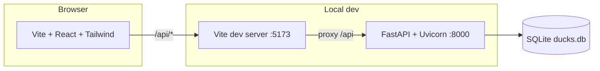

# Duck lottery — fun facts mini app

A small full-stack “pondside” app: you **draw three Jeopardy-style clues** (no species names in the text), **pick a clue**, then get **confetti** and the **duck species** behind that fact. Facts and taxonomy live in **SQLite**; the UI talks to a **FastAPI** backend.

---

## What it does

1. **Health** — `GET /api/health` returns `{ "status": "ok" }`.
2. **Random clues** — `GET /api/facts/random?count=3` returns `count` clues (default 3), each from a **different** species (one random fact per species, then a random subset). Each item is `{ id, fact, citations }` where `citations` is a URL array (JSON in SQLite); there are **no** species fields on the clue—so the reveal stays a surprise.
3. **Reveal** — `GET /api/facts/{fact_id}/reveal` returns `{ duck, fun_fact, citations }`: the species for that fact, the same clue text, and the same citation links.

The React app drives that flow: idle → load three clues → pick a clue → load reveal → show species + clue (with optional new round / reset).

---

## Architecture



| Layer | Role |
|--------|------|
| **Frontend** | SPA (`frontend/`): React 18, TypeScript, Tailwind, `canvas-confetti` for celebration. Calls `/api/...` as relative URLs. |
| **Dev proxy** | Vite proxies `/api` → `http://127.0.0.1:8000` so the browser stays same-origin during development. |
| **Backend** | FastAPI app (`backend/app/main.py`): CORS enabled for `*`; JSON APIs; SQLite via stdlib `sqlite3`. |
| **Data** | Single SQLite file (default `backend/data/ducks.db`), created/seeded by `backend/scripts/seed_db.py`. |

**Runtime flow**

1. User starts **Vite** (port **5173**) and **Uvicorn** (port **8000**).
2. `fetch("/api/facts/random?count=3")` hits Vite → proxy → FastAPI.
3. FastAPI opens SQLite (`get_connection()` in `app/database.py`), runs SQL, returns JSON.
4. After a pick, `fetch("/api/facts/{id}/reveal")` returns the species behind that clue plus the clue text.

---

## Database schema

SQLite with **foreign keys** enforced (`PRAGMA foreign_keys = ON` in the seed script).

### Tables

**`species`** — one row per duck species shown in the UI.

| Column | Type | Notes |
|--------|------|--------|
| `id` | `INTEGER` | Primary key, autoincrement |
| `name` | `TEXT` | Common name, `NOT NULL`, `UNIQUE` |
| `scientific_name` | `TEXT` | Binomial, `NOT NULL` |

**`fun_facts`** — multiple clues per species; the random-facts endpoint samples one clue per species, then picks `count` species; the reveal endpoint joins a fact to its species.

| Column | Type | Notes |
|--------|------|--------|
| `id` | `INTEGER` | Primary key, autoincrement |
| `species_id` | `INTEGER` | `NOT NULL`, FK → `species(id)` `ON DELETE CASCADE` |
| `fact` | `TEXT` | `NOT NULL` |
| `citations` | `TEXT` | `NOT NULL` — JSON array of URL strings (at least one per row in the seed data) |

**Index**

- `idx_fun_facts_species` on `fun_facts(species_id)` — speeds lookups by species.

### DDL (as created by the seed script)

```sql
PRAGMA foreign_keys = ON;

CREATE TABLE species (
    id INTEGER PRIMARY KEY AUTOINCREMENT,
    name TEXT NOT NULL UNIQUE,
    scientific_name TEXT NOT NULL
);

CREATE TABLE fun_facts (
    id INTEGER PRIMARY KEY AUTOINCREMENT,
    species_id INTEGER NOT NULL REFERENCES species(id) ON DELETE CASCADE,
    fact TEXT NOT NULL,
    citations TEXT NOT NULL
);

CREATE INDEX idx_fun_facts_species ON fun_facts(species_id);
```

Seeding **drops** existing `fun_facts` and `species` and reloads bundled content (many species, several facts each). Run seed whenever you need a fresh database.

---

## Prerequisites

- **Python** 3.10+ (3.11+ recommended)
- **Node.js** 18+ and npm

---

## Install and run

### 1. Backend — dependencies

From the repository root:

```bash
cd backend
python -m venv .venv
```

**Windows (PowerShell)**

```powershell
.\.venv\Scripts\Activate.ps1
pip install -r requirements.txt
```

**macOS / Linux**

```bash
source .venv/bin/activate
pip install -r requirements.txt
```

### 2. Backend — database

Still inside `backend/` (or use the path below from the repo root):

```bash
python scripts/seed_db.py
```

From the **repository root** you can instead run:

```bash
python backend/scripts/seed_db.py
```

This creates `backend/data/ducks.db` (and `data/` if needed) with schema + seed data.

### 3. Backend — API server

From `backend/` with the virtual environment active:

```bash
uvicorn app.main:app --reload --host 127.0.0.1 --port 8000
```

Leave this process running.

### 4. Frontend — install and dev server

In a **second** terminal, from the repository root:

```bash
cd frontend
npm install
npm run dev
```

Open the URL Vite prints (typically **http://localhost:5173**). The UI expects the API on **8000** via the Vite proxy.

### 5. Quick verification

- Browser: open the app, click **Randomize three ducks**, pick one — you should see a fact and confetti.
- Or: `curl http://127.0.0.1:8000/api/health`

---

## Optional: custom database path

By default the API uses `backend/data/ducks.db`. Override with:

```bash
set DUCK_DB_PATH=C:\path\to\custom.db
```

On macOS/Linux:

```bash
export DUCK_DB_PATH=/path/to/custom.db
```

Ensure that file exists and matches the schema (e.g. by copying a seeded DB or running the seed script against that path — the seed script currently writes to `backend/data/ducks.db` only; for a custom path you would copy the file or adjust the script).

---

## Project layout

```
duck-applet/
├── backend/
│   ├── app/
│   │   ├── main.py        # FastAPI routes
│   │   └── database.py  # SQLite path + connection helper
│   ├── scripts/
│   │   └── seed_db.py   # Schema + seed data
│   ├── data/              # ducks.db (see .gitignore: backend/data/*.db)
│   └── requirements.txt
└── frontend/
    ├── src/
    │   ├── App.tsx
    │   ├── api.ts
    │   └── confettiBurst.ts
    ├── vite.config.ts     # /api → :8000 proxy
    └── package.json
```

---

## Production notes

- **`npm run build`** produces static assets under `frontend/dist/`. They still call `/api/...`; you need a host that **reverse-proxies** `/api` to your FastAPI service (or change the frontend to use an absolute API base URL).
- Tighten **CORS** in `main.py` if you deploy beyond local demos.

---

## License

Add a `LICENSE` file if you publish this repository; none is included in the scaffold by default.
